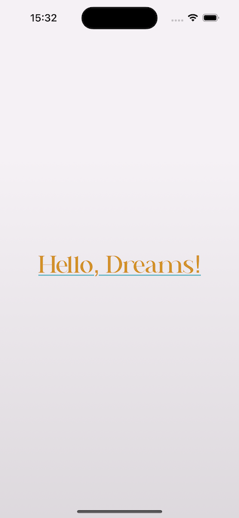

# Dreams

Example of extracting design code from the main app using Swift Package Manager.  

```swift
import DreamsDesign
import SwiftUI

struct ContentView: View {
  var body: some View {
    ZStack {
      Rectangle()
        .fill(.dreamsSilver.gradient)
        .ignoresSafeArea()
      Text("Hello, Dreams!")
        .foregroundStyle(.dreamsGold)
        .underline(color: .dreamsTeal)
        .font(.dreams(size: 40, weight: .medium))
    }
  }
}
```


